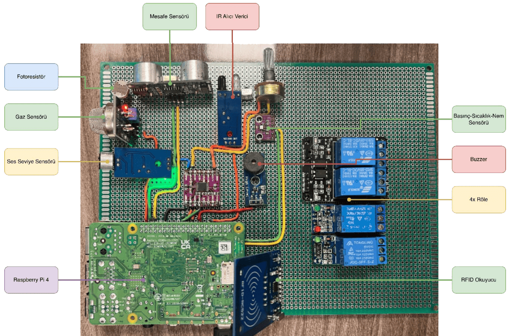
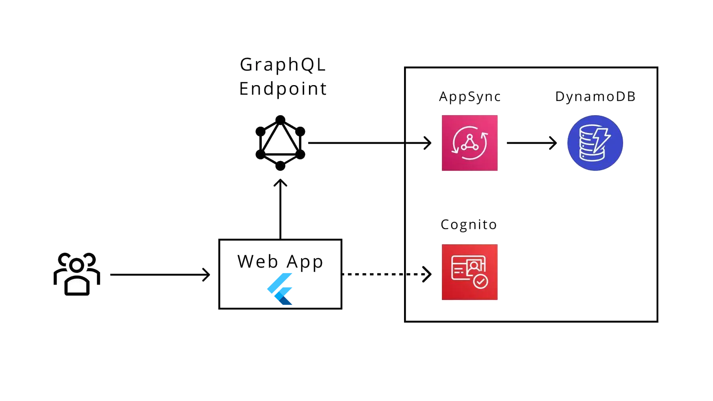
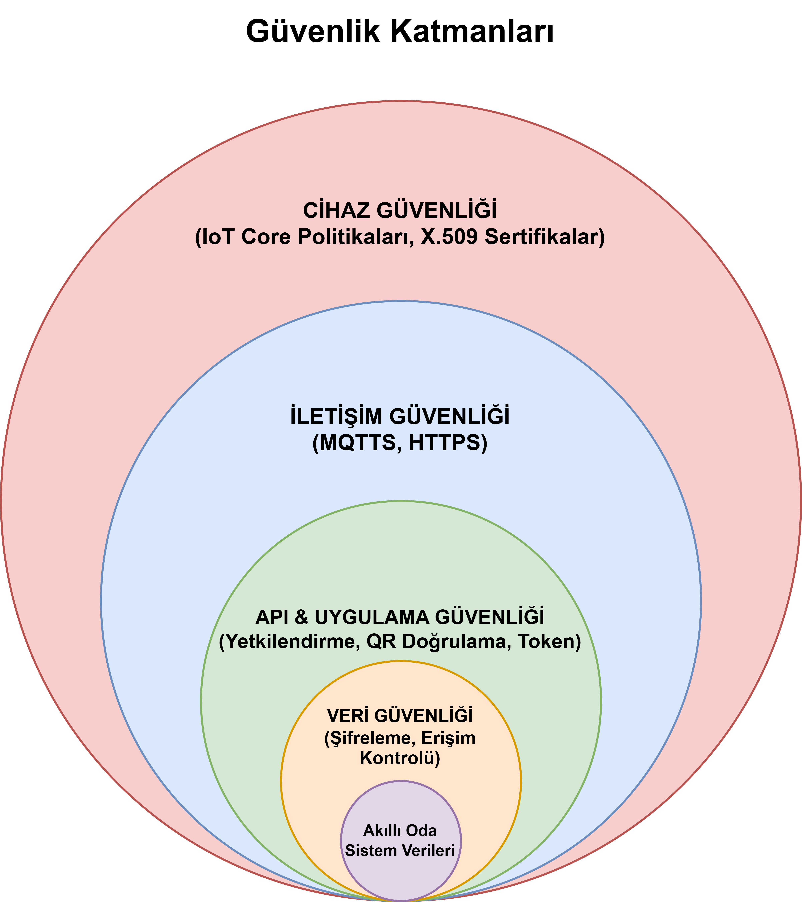
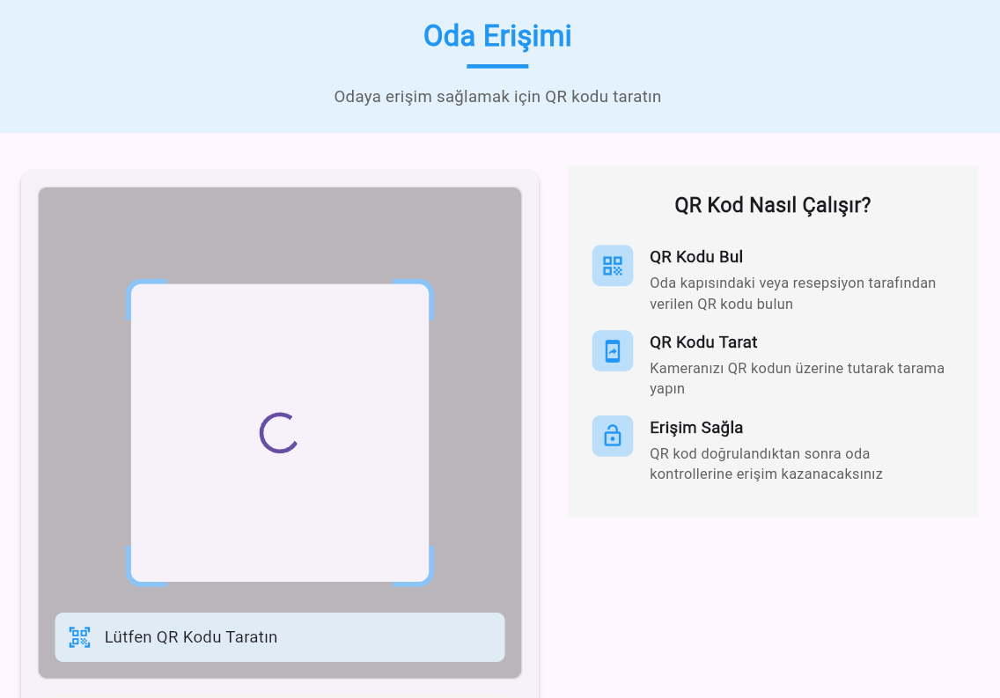
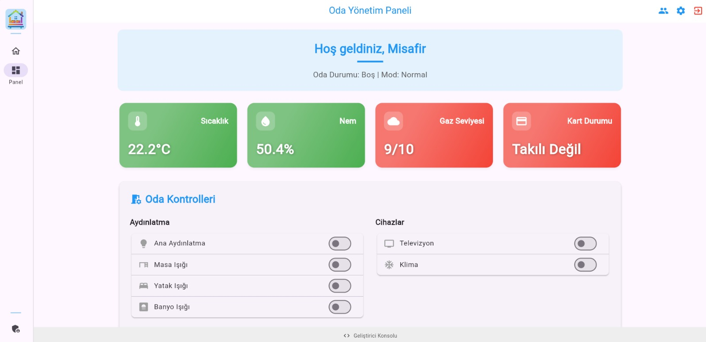
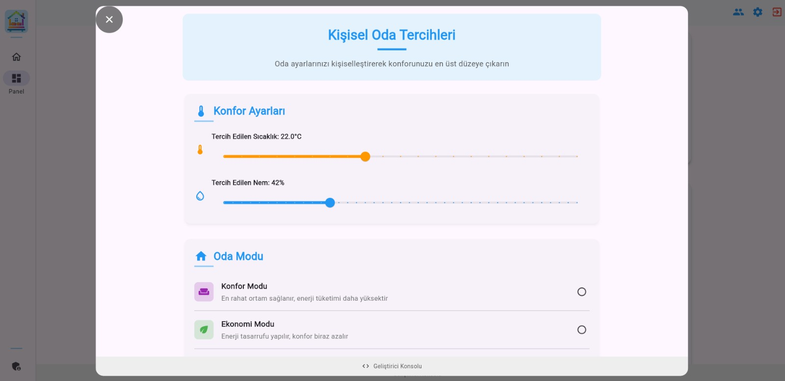
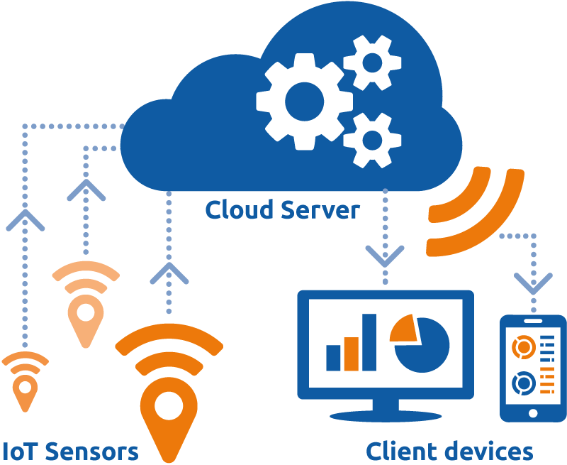

# HotelMind: AWS-Based Smart Room Automation System
*Cloud Computing Research and IoT Application*

🏆 **Award Winner**: Proudly achieved **3rd Place at TEKNOFEST 2025** in the Tourism Technologies (*Turizm Teknolojileri*) category!


https://github.com/user-attachments/assets/af0ca069-10da-4d48-999c-76e172448867

## 📖 Overview
HotelMind is a comprehensive, scalable smart room automation system leveraging Amazon Web Services (AWS) cloud infrastructure and Internet of Things (IoT) technologies. Originally developed as an academic capstone project, the system seamlessly connects physical sensors and actuators (via Raspberry Pi) to a powerful, serverless cloud backend and a modern Flutter-based web interface. 

The overarching goal is to explore the migration from traditional hardware architectures to fully managed Cloud (PaaS/SaaS) services, emphasizing security, scalability, and automated machine learning-driven decision-making.

---

## 🎯 Key Features
- **⚡ Real-Time Monitoring**: Instantly observe temperature, humidity, gas levels, and room occupancy via the reactive Flutter web app (`fl_chart` integrations).
- **🎛️ Remote Control**: Control room lighting, climate, and appliances remotely with near-zero latency.
- **🤖 Smart Automation & AI**: Cloud-hosted AI Agent Lambda functions analyze historical behavior and current conditions to automate decisions (e.g., energy optimization, proactive environmental adjustments).
- **🔐 Dynamic QR Code Access**: Uses short-lived, cryptographically signed QR codes to grant secure, temporary access to rooms, eliminating the need for physical keys.
- **🚨 Proactive Safety Alerts**: Immediate device-to-cloud and cloud-to-device alarm mechanisms for critical events like gas leaks or unauthorized entry.

---

## 🏗️ System Architecture
The project heavily utilizes AWS PaaS and managed SaaS components, ensuring extreme scalability and minimal infrastructure management overhead.


### 1. Hardware (Edge / IoT Device)
The physical room environment is managed locally by a microcontroller.
- **Controller**: Raspberry Pi
- **Sensors**: BMP280 (Temp/Humidity/Pressure), HC-SR04 (Distance/Occupancy), MQ-2 (Gas), RC522 (RFID)
- **Actuators**: Relays (Power Control), IR Transmitter (Device Control), LCD, Mini Speaker.



### 2. Cloud Backend (AWS)
- **AWS IoT Core**: Central hub for MQTT communication, secure X.509 certificate-based authentication, and rule-based message routing.
- **AWS Lambda**: Serverless compute executing discrete business logic:
  - `ProcessSensorData`: Ingests and cleanses telemetry.
  - `RequestRoomControl`: Manages user control events.
  - `verify-qr` & `secret-key`: Manages crypto signatures for access control.
  - `ai-agent`: Executes automated machine learning/rules logic.
- **Amazon DynamoDB**: Managed NoSQL database storing `SensorData`, `RoomEvent`, `UserPreference`, and `QrSession`.
- **AWS AppSync**: Provides a robust GraphQL API, gracefully bridging the Flutter frontend with Lambda resolvers and DynamoDB datasets.
- **AWS Amplify**: Simplifies the provisioning and integration of cloud services into the frontend application.



#### End-to-End Data Flow
The diagram below illustrates the complete data pipeline — from MQTT ingestion through IoT Core rules, Lambda processing, DynamoDB persistence, and real-time GraphQL subscriptions back to the client.


---

## 🔐 Security & Access Control
Security is implemented using a strict "Defense-in-Depth" approach:



- **Device Level (IoT Core)**: Strict X.509 Certificates and MQTTS (TLS) encryption. IAM policies restrict MQTT topic pub/sub rights per device.
- **API Level**: AWS IAM and AppSync authentication manage application-to-cloud security.
- **User Access (QR Codes)**: The backend generates a temporary `secretKey` that the Raspberry Pi uses to sign a dynamic QR code. The user scans this code via the web app, and the `verify-qr` Lambda validates the signature and timestamp, granting access while mitigating replay and brute-force attacks.

<p align="center">
  
</p>

---

## 🖥️ User Interface (Flutter)
The frontend is built using the Flutter framework, offering a seamless cross-platform experience. It connects to AWS via the Amplify SDK. State changes are pushed instantly to the UI using AppSync GraphQL Subscriptions.

<table>
  <tr>
    <td></td>
    <td></td>
  </tr>
</table>

---

## 📂 Project Structure

```

hotelmind/
├── amplify/              # AWS Amplify backend (Lambda functions, AppSync schema, auth)
│   ├── data/             #   GraphQL schema & resolvers
│   └── functions/        #   Lambda handlers (ai-agent, verify-qr, sensor-data, etc.)
├── iot/                  # Raspberry Pi edge application
│   ├── sensors/          #   Sensor drivers (BMP280, HC-SR04, MQ-2, …)
│   ├── actuators/        #   Output device controllers (IR, LED, speaker, …)
│   ├── cloud/            #   AWS IoT Core MQTT client
│   ├── utils/            #   Config, logging, QR code generator
│   └── main.py           #   Entry point for the edge agent
├── lib/                  # Flutter frontend
│   ├── models/           #   Data models
│   ├── screens/          #   UI screens (dashboard, login, …)
│   ├── services/         #   AWS service integrations
│   └── widgets/          #   Reusable UI components
└── assets/               # Images, icons, sounds, documentation

```

---

## 🚀 Getting Started

### Prerequisites
- Node.js (v18+)
- Python (3.9+)
- Flutter SDK (3.x)
- AWS CLI configured with administrator privileges.

### Backend Setup (AWS Amplify)
```bash
npm install -g @aws-amplify/cli
cd hotelmind
amplify init
amplify push

```

### IoT Device Setup (Raspberry Pi)

1. Install Python dependencies:
```bash
cd iot
pip install -r requirements.txt

```


2. Place your AWS IoT Core certificates (`certificate.pem.crt`, `private.pem.key`, `AmazonRootCA1.pem`) inside the `iot/certs/` directory.
3. Create `secrets.json` in the `iot/certs/` directory with your endpoint configuration.
4. Run the main edge agent:
```bash
python main.py --verbose

```


*(Use `--mock` to run without real hardware attached).*

### Frontend Setup (Flutter)

```bash
cd hotelmind
flutter pub get
flutter run -d chrome

```

---

## 👥 Team & Contributions

| Member | Role & Responsibilities |
| :--- | :--- |
| **Mustafa Yavuz OKUMUŞ** | **Software Architecture & Cloud Lead** — Full-Stack Software Development (Flutter Web App, Cloud Backend on AWS AppSync/DynamoDB/Lambda, IoT Core MQTT Integration & Python Edge Agent / Sensor Drivers) *(Original Codebase & Graduation Capstone)* |
| **Cem Girgin** | **Hardware & Electronics** — Circuit & Custom PCB Design, Sensor & Actuator Wiring, Physical Prototyping & Enclosure Fabrication |

---

## 📜 Academic Context

This project was developed by **Mustafa Yavuz OKUMUŞ** as a graduation capstone project at Istanbul Kültür University, Department of Mathematics and Computer Science.

The project evaluates and compares leading cloud providers (AWS, Azure, GCP) and cloud service models (IaaS, PaaS, SaaS) for IoT ecosystems, ultimately electing an AWS PaaS/SaaS hybrid model for its scalability, mature ecosystem, and development velocity.

---

### 📚 Additional Resources

For more detailed information, including the comprehensive **Academic Article** and **Presentation** for this project, please visit:
🔗 [https://sc-riber.com/projects/hotelmind](https://sc-riber.com/projects/hotelmind)

---

## 📄 License

This project is licensed under the [MIT License](https://www.google.com/search?q=LICENSE).


